# Comprehensive Audit Remediation Roadmap & Effort Estimates

**Target Applications**: Resume Builder, GitHub README Specialist, LinkedIn Profile Studio  
**Date**: September 16, 2026  
**Document Purpose**: Prioritized breakdown and dual engineering time estimates (Traditional Manual vs. Agentic Coding) for remediating vulnerabilities, state desynchronization, AI prompt conflicts, and silent state reversion bugs identified in the deep technical audits.

---

## Executive Summary

Across the three builders, technical audits identified **23 discrete issues** spanning:
1. **Critical Security**: Client-only authorization exposing serverless OpenAI endpoints to unauthorized access.
2. **Core AI Execution Flaws**: Overly rigid backend section-locking and regex gates that silently discard OpenAI's edits while telling the user "Done!".
3. **Data Loss & State Drift**: Complete separation between manual form editors and AI studios with zero bidirectional sync.
4. **Formatting & Infrastructure Glitches**: Puppeteer PDF memory leaks, forced metric concatenations, and fragile cover art font scaling.

### Velocity Overview
- **Traditional Manual Engineering**: **38 to 45 hours (~5 to 6 working days)**.
- **Agentic Coding (AI Pair Programming + Automated Verification)**: **7 to 10 hours (~1.5 to 2 working days)**.
- **Acceleration**: **~4x to 5x faster** due to sub-second AST code navigation, automated regex refactoring, instant sub-100ms `bun test` feedback, and automated TypeScript verification.

---

## Velocity Comparison: Traditional Manual vs. Agentic Coding

| Phase | Milestone Name | Scope | Traditional Manual | With Agentic Coding | Acceleration |
|:---:|---|---|:---:|:---:|:---:|
| **Phase 1** | **Security & Core AI Unlocking** | P0.1 – P0.5 | 10 – 12 hrs | **1.5 – 2.5 hrs** | **~5x** |
| **Phase 2** | **State Sync & AI Data Integrity** | P1.1 – P1.8 | 13 – 16 hrs | **2.5 – 3.5 hrs** | **~4.5x** |
| **Phase 3** | **Logic Cleanup & Feature Parity** | P2.1 – P2.8 | 13 – 15 hrs | **2.5 – 3.0 hrs** | **~5x** |
| **Phase 4** | **Storage Optimization & Regression Suite** | P3.1 + E2E Suite | 3 – 4 hrs | **45 min – 1 hr** | **~4x** |
| **TOTAL** | **Full Audit Remediation** | **All 23 Issues** | **38 – 45 hrs (~6 Days)** | **~7 – 10 hrs (~1.5 to 2 Days)** | **~4.5x** |

### Why Agentic Coding Delivers a 4x–5x Speedup in This Codebase:
1. **Instant AST & Multi-File Localization**: Finding exact lines where regex gates race or post-processing section locks overwrite data in 2,500-line routes takes seconds via ripgrep and structural inspection.
2. **Sub-100ms Unit Testing with Bun**: Test suites (such as `educationReplacement.test.ts` with 47+ assertions) run in **under 75ms**. Regressions are caught and corrected immediately in the same turn.
3. **Automated Schema & Transformer Generation**: Writing bidirectional data mappers between `ResumeData` and `CvData` is boilerplate-heavy manually, but generated and type-validated in minutes with an agent.
4. **Instant Compiler Feedback**: `bunx tsc --noEmit` validates the entire Next.js project in 5–8 seconds, ensuring zero runtime type errors before code lands.

---

## Prioritized Issues & Engineering Effort Breakdown

### Priority 0: Critical (Immediate / Security & Core Product-Breaking)
*Issues that compromise API security, leak server resources, or cause core editing features to silently fail.*

| # | Issue / Fix | Target Files | Technical Root Cause & Remediation | Manual Effort | Agentic Effort |
|---|---|---|---|:---:|:---:|
| **P0.1** | **Server-Side Authorization Whitelist Bypass** | `app/api/resume-chat/route.ts` `app/api/github-chat/route.ts` `app/api/linkedin-rich-chat/route.ts` | Whitelist verification (`BUILDER_ACCESS_EMAILS`) is enforced only on the frontend (`BlockScreen.tsx`). Direct API requests bypass this check, allowing unauthorized OpenAI credit consumption. **Fix**: Add server-side email verification against `user.primaryEmailAddress` on all API routes. | 1 – 1.5 hrs | **15 – 20 min** |
| **P0.2** | **Silent Section Locking Reverting AI Edits** | `app/api/resume-chat/route.ts` | The backend forcibly resets `safeCv.workExperience = cv.workExperience` (and other sections) if user prompts lack specific keywords. The LLM correctly modifies the CV, but post-processing silently restores the old state while returning *"Done!"*. **Fix**: Remove rigid section locks. | 2 – 2.5 hrs | **20 – 30 min** |
| **P0.3** | **Forced Metric String Injection on Bullets** | `app/api/resume-chat/route.ts` | Post-processing forcibly appends hardcoded metrics (e.g. `— increasing overall project efficiency by 25%`) to every bullet without numbers, corrupting user copy and malforming HTML. **Fix**: Remove this forced concatenation hook. | 1 hr | **10 – 15 min** |
| **P0.4** | **Puppeteer PDF Generation Hang & Memory Leak** | `app/api/pdf/route.ts` | Relies on external Tailwind CDN `<script>` with `setTimeout(1500)` and lacks `try...finally { browser.close() }`. CDN hiccups cause 500 errors and leave orphan Chromium processes. **Fix**: Inline CSS styles and enforce `browser.close()` in `finally`. | 2 – 3 hrs | **20 – 30 min** |
| **P0.5** | **Regex Race Conditions & Brittle Interceptors** | `app/api/resume-chat/route.ts` | `isMultiSentenceOrStory` races against ~1,000 lines of sequential regex gates. Depending on exact user wording, requests either bypass OpenAI completely or get misparsed. **Fix**: Consolidate intent detection and allow LLM fallback. | 3 – 4 hrs | **30 – 45 min** |

> **P0 Subtotal**: **Manual: 9.5 – 12 hrs** | **Agentic: 1.5 – 2.5 hrs**

---

### Priority 1: High (Data Loss, Integrity & AI Reliability)
*Issues that cause state drift between tabs, corrupt undo/redo history, or result in contradictory AI edits.*

| # | Issue / Fix | Target Files | Technical Root Cause & Remediation | Manual Effort | Agentic Effort |
|---|---|---|---|:---:|:---:|
| **P1.1** | **Editor vs. Chat Studio State Desynchronization** | `app/page.tsx` `components/ResumeRoute.tsx` | `ResumeEditor` (`ResumeData`) and `ResumeChatStudio` (`CvData`) operate on independent state stores with no bi-directional synchronization, losing edits when switching modes. **Fix**: Build automated two-way state transformers. | 3 – 4 hrs | **30 – 45 min** |
| **P1.2** | **Education "Preservation" Resurrecting Deleted Entries** | `app/api/resume-chat/route.ts` | When the model deletes an education entry, post-processing compares array lengths and re-adds the missing entry. **Fix**: Honor explicit deletion intent from the LLM. | 1.5 – 2 hrs | **20 – 25 min** |
| **P1.3** | **Student vs. Professional Mode Dropping Edits** | `app/api/resume-chat/route.ts` | For student CVs, work experience edits are discarded; for professional CVs, workshop edits are discarded, while the AI claims success. **Fix**: Allow valid updates across active sections. | 1.5 – 2 hrs | **20 – 25 min** |
| **P1.4** | **Undo/Redo Object Reference Mutation** | `components/ResumeChatStudio.tsx` | `setPast((p) => [...p, cv])` pushes mutable object references, causing subsequent edits to retroactively mutate previous history snapshots. **Fix**: Replace with `structuredClone(cv)`. | 0.5 – 1 hr | **10 min** |
| **P1.5** | **GitHub Chat Contradictory Markdown Prompts** | `app/api/github-chat/route.ts` | System prompt forbids markdown formatting in all text fields while simultaneously demanding markdown links for projects and markdown in custom sections. **Fix**: Standardize with strict JSON schemas. | 2 – 2.5 hrs | **25 – 30 min** |
| **P1.6** | **LinkedIn Cover Text Truncation & State Reset** | `app/api/linkedin-rich-chat/route.ts` `components/LinkedinChatStudio.tsx` | `fitToLimit` truncates cover copy mid-word, and `PROTECTED_KEYS` drop custom templates/photo gradients on text edits. **Fix**: Preserve existing keys and implement client auto-scaling. | 2 – 3 hrs | **30 – 40 min** |
| **P1.7** | **LinkedIn Empty Field Fallback Blocking Removals** | `app/api/linkedin-rich-chat/route.ts` | Asking to "clear my location" returns empty strings from OpenAI, but backend fallback re-injects the old value. **Fix**: Distinguish explicit clearing from omitted keys. | 1 hr | **15 min** |
| **P1.8** | **GitHub Profile Save Creating Duplicate Records** | `components/GithubChatStudio.tsx` `app/api/github-saves/route.ts` | Auto-save routines fail to forward `activeSavedId`, causing the backend to execute `.create()` instead of `.update()`. **Fix**: Pass active profile ID consistently. | 1 hr | **15 min** |

> **P1 Subtotal**: **Manual: 12.5 – 16.5 hrs** | **Agentic: 2.5 – 3.5 hrs**

---

### Priority 2: Medium (Logic Inconsistencies & UX Parity)
*Issues that lead to unexpected AI additions/deletions, formatting quirks, or UI feature discrepancies.*

| # | Issue / Fix | Target Files | Technical Root Cause & Remediation | Manual Effort | Agentic Effort |
|---|---|---|---|:---:|:---:|
| **P2.1** | **Hardcoded Project Keyword Swaps** | `app/api/resume-chat/route.ts` | Prompts mentioning "post generator" inject an unasked-for project and delete any project containing "legalsummarize". **Fix**: Remove hardcoded keyword triggers. | 1 hr | **10 min** |
| **P2.2** | **ATS Tokenizer Injecting Garbage Suffixes** | `app/api/resume-chat/route.ts` | Naive tokenizer splits `.NET` to `NET`, `C++` to `C`, and appends nonsensical phrases like `, utilizing NET, e.g to drive robust execution`. **Fix**: Replace with curated tech dictionary matcher. | 2 – 2.5 hrs | **25 – 30 min** |
| **P2.3** | **Free-Tier Counter Deducted Before API Success** | All 3 Chat API Routes | Usage counter increments in database before OpenAI call completes; if OpenAI times out or errors, the user loses a free turn. **Fix**: Increment usage only on successful resolution. | 1 – 1.5 hrs | **15 min** |
| **P2.4** | **Dual Conflicting ATS Scoring Algorithms** | `app/page.tsx` `app/api/ats-score/route.ts` | Landing page computes a naive bio/bullet length score (e.g. 82%), while the studio button queries AI evaluation (e.g. 64%) for the same resume. **Fix**: Unify under a single calculation module. | 2 hrs | **20 – 25 min** |
| **P2.5** | **LinkedIn Cover Art `cqw` Font Collapse** | `lib/ShrinkToFitCoverText.tsx` `components/LinkedinChatStudio.tsx` | Pure `cqw` units collapse to `0px` font size when parent containers lack explicit widths in flex layouts. **Fix**: Provide fallback standard sizing with aspect-ratio scaling. | 2 – 2.5 hrs | **25 – 30 min** |
| **P2.6** | **LinkedIn Header Save/Rename Dropdown Missing** | `components/LinkedinChatStudio.tsx` | Unlike Resume and GitHub studios, LinkedIn Studio lacks an in-header rename/saved-profile dropdown controller. **Fix**: Port dropdown controller from `ResumeChatStudio`. | 2 – 3 hrs | **30 – 40 min** |
| **P2.7** | **Expired SAS Tokens on Banner Image Presets** | `lib/githubRolePresets.ts` | External banner URLs have expired Azure SAS tokens, resulting in broken image 403s. **Fix**: Re-host static SVG/PNG assets in local project `/public` storage. | 1.5 – 2 hrs | **20 min** |
| **P2.8** | **GitHub Random Banner Re-Assignment** | `app/api/github-chat/route.ts` | AI re-picks a random banner during simple text edits. **Fix**: Explicitly mandate banner preservation in the system prompt. | 1 hr | **10 min** |

> **P2 Subtotal**: **Manual: 12.5 – 15.5 hrs** | **Agentic: 2.5 – 3 hrs**

---

### Priority 3: Low (Housekeeping & Preventive Maintenance)
*Non-breaking optimization and browser storage cleanup.*

| # | Issue / Fix | Target Files | Technical Root Cause & Remediation | Manual Effort | Agentic Effort |
|---|---|---|---|:---:|:---:|
| **P3.1** | **Unbounded `localStorage` History Growth** | `app/page.tsx` | Full chat histories and states are stored in browser storage without length caps, risking `QuotaExceededError`. **Fix**: Cap chat history at the last 20 messages per session. | 1 – 1.5 hrs | **15 min** |

> **P3 Subtotal**: **Manual: 1 – 1.5 hrs** | **Agentic: 15 min**

---

## 2-Day Agentic Coding Sprint Plan

```mermaid
gantt
    title Agentic Coding 2-Day Sprint Plan (~7 to 10 Hours Total)
    dateFormat  HH:mm
    axisFormat %H:%M
    section Day 1 Morning: Critical Core (P0)
    P0.1 Server-Side Auth Checks             :a1, 00:00, 20m
    P0.2 Remove Backend Section Locks        :a2, after a1, 30m
    P0.3 Remove Forced Metric Concatenation  :a3, after a2, 15m
    P0.4 Fix Puppeteer PDF Engine & OOM      :a4, after a3, 30m
    P0.5 Consolidate Regex Interceptors      :a5, after a4, 40m
    section Day 1 Afternoon: State & Integrity (P1)
    P1.1 Two-Way Editor State Synchronization:b1, 02:15, 45m
    P1.2 Education Preservation / Deletion   :b2, after b1, 20m
    P1.3 Student vs Pro Mode Handling        :b3, after b2, 25m
    P1.4 Undo/Redo structuredClone           :b4, after b3, 10m
    P1.5 GitHub Chat JSON Schema Standard    :b5, after b4, 30m
    P1.6 LinkedIn Cover Auto-Budgeting       :b6, after b5, 35m
    P1.7 & P1.8 LinkedIn Fallback & Save Dups:b7, after b6, 25m
    section Day 2 Morning: Logic & Parity (P2)
    P2.1 & P2.2 ATS Tokenizer & Project Fix  :c1, 05:25, 40m
    P2.3 & P2.4 Quota Increment & ATS Scores :c2, after c1, 40m
    P2.5 & P2.6 LinkedIn Cover Scaling & Menu:c3, after c2, 50m
    P2.7 & P2.8 Static Banners & Preservation:c4, after c3, 30m
    section Day 2 Afternoon: Polish & QA (P3 + Test)
    P3.1 LocalStorage Pruning                :d1, 08:05, 15m
    End-to-End Regression Tests & Verification:d2, after d1, 40m
```

---

## Next Steps

To begin execution immediately, the recommended starting point is **Phase 1 (P0)**:
1. **P0.1**: Add server-side email verification checks to protect the OpenAI API key and credit budget.
2. **P0.2 & P0.3**: Eliminate backend section-locking and forced metric string concatenation in `app/api/resume-chat/route.ts` to permanently resolve the *"AI says done but changes are missing"* bug.
3. **P0.4**: Fix the Puppeteer PDF generation error handling and clean up headless Chromium process lifecycles.
